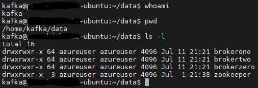
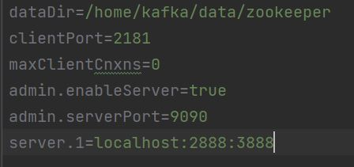
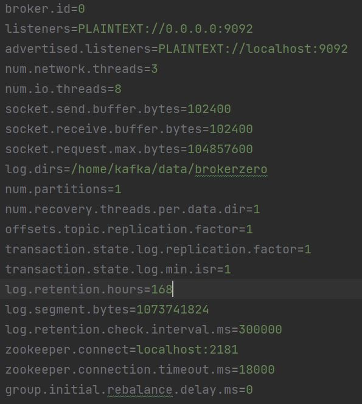

# Setup Kafka with SASL and SSL Authentication 
There are multiple articles available in the internet about how to setup a basic kafka with no security features involved. Without security we may feel that the messages transfered through our topics can be read by anyone who intercepts the traffic.
Since release 0.9.0.0, the Kafka community added a number of features that, used either separately or together, increases security in a Kafka cluster. The following security measures are currently supported:
1. Authentication of connections to brokers from clients (producers and consumers), other brokers and tools, using either SSL or SASL. Kafka supports the following SASL mechanisms:
  - SASL/GSSAPI (Kerberos) - starting at version 0.9.0.0
  - SASL/PLAIN - starting at version 0.10.0.0
  - SASL/SCRAM-SHA-256 and SASL/SCRAM-SHA-512 - starting at version 0.10.2.0
  - SASL/OAUTHBEARER - starting at version 2.0
2. Authentication of connections from brokers to ZooKeeper
3. Encryption of data transferred between brokers and clients, between brokers, or between brokers and tools using SSL (Note that there is a performance degradation when SSL is enabled, the magnitude of which depends on the CPU type and the JVM implementation.)
4. Authorization of read / write operations by clients
5. Authorization is pluggable and integration with external authorization services is supported

There are no ready made out of the box configuration after downloading to configure the security. 
In this article I will show you how to configure the latest version of Kafka 3.2 with SASL authentication along with SSL encryption and SASL/SCRAM-SHA-512 authorization.
My Article is closely related to these two articles which helped me configure the SASL_SSL security

[To know more on SSL Encryption and authentication](https://medium.com/@vinod.chelladuraiv/kafka-ssl-encryption-authentication-part-one-certification-authority-keystore-and-truststore-12a2eb537cfe)

[Practical implementation of SSL in Kafka Brokers](https://medium.com/@vinod.chelladuraiv/kafka-ssl-encryption-authentication-part-two-practical-example-for-implementing-ssl-in-kafka-d514f30fe782)

## Kafka Installation 
If you haven't installed Kafka already, Here is a short recap on how to install Kafka 
### Download and install jdk
Kafka runs using Java. So installation of Java is mandatory before installing kafka

Update system once before installing Jdk
```
sudo apt update
```
Its better to have Java8 if you are generating CA and certificates yourselves. So I installed openjdk-8
```
sudo apt install openjdk-8-jdk
```
### Download and Install Kafka
Here I downloaded Kafka 3.2
#### Download from apache website
website link https://kafka.apache.org/downloads. Get the recent version. I downloaded version 3.2.0 Make sure you download the binaries not the source

```
sudo wget https://dlcdn.apache.org/kafka/3.2.0/kafka_2.13-3.2.0.tgz -O /opt/kafka_2.13-3.2.0.tgz
```

#### Extract and install
```
cd /opt/
sudo tar -xvf kafka_2.13-3.2.0.tgz
```
#### Create symbolic link /opt/kafka
```
sudo ln -s /opt/kafka_2.13-3.2.0 /opt/kafka
```
#### Create a non-root user Kafka and provide permission to /opt/kafka
```
sudo useradd kafka
```
```
sudo chown -R kafka:kafka /opt/kafka*
```
Now kafka user will have permission to run kafka

#### Add Kafka installation folder to the system path
Use the below commands to add to the path
```
export KAFKA_HOME=/opt/kafka
```
```
export PATH=$KAFKA_HOME/bin:$PATH
```
If you want the path to be added permanently to Linux. You need to add it to your ~/.profile or ~/.bashrc file. 
```
export KAFKA_HOME=/opt/kafka
export PATH=$KAFKA_HOME/bin:$PATH
```
Add the above two lines to ~/.profile or ~/.bashrc file.
Kafka binaries can now be accessed anywhere from your system. 

Now you have successfully downloaded kafka and Installed on your system.
#### Data Directories

We need to specify few directories where we can have the zookeeper data and broker data

Created the below directories in the home directory of non-root user kafka
```
mkdir /home/kafka/data
cd data 
```
```
mkdir zookeeper
```
```
mkdir brokerzero
```
```
mkdir brokerone
```
```
mkdir brokertwo
```

## Basic Run
To test if the version of the Kafka that we downloaded works without any issues. We can run Kafka with minimal configuration without any SSL or SASL at this stage.

For the basic run we need to configure the one zookeeper and three brokers. These files are present inside the directory /opt/kafka/config

### Zookeeper config 
Modify /opt/kafka/zookeeper.properties to have this below config 



### Broker Configs
Important things to note in Broker config is that we need to have different broker.id for each brokers. 

Modify the log.dirs to the corresponding data dir that you created in the previous step.

####  Broker Zero Config 


#### Broker One Config
Similar to broker zero but the changes come in the broker.id and the logs.dir property. 
Also the listeners and advertised.listeners should have a different port number. Other wise you will get port is in use error while starting broker one.

#### Broker Two Config
Similar to broker zero but the changes come in the broker.id and the logs.dir property.
Also the listeners and advertised.listeners should have a different port number. Otherwise you will get port is in use error while starting broker two.