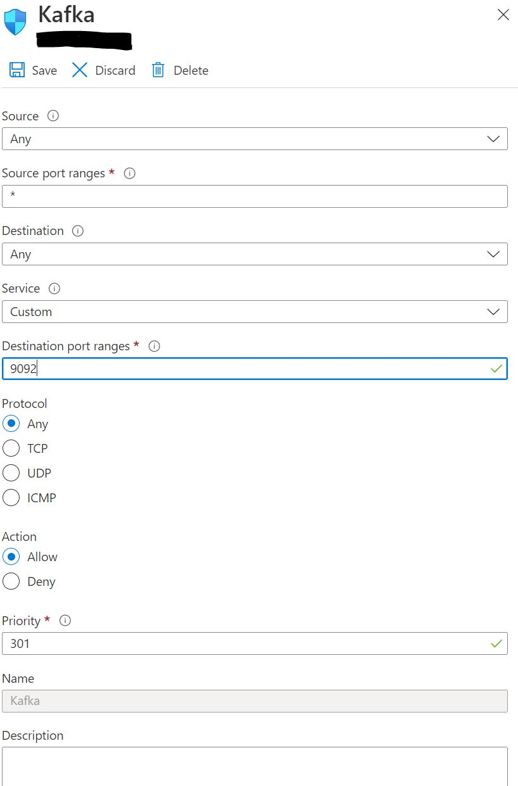
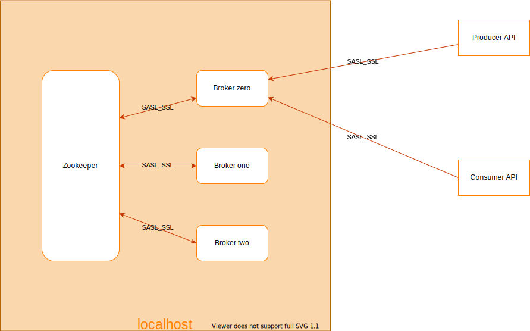

# Setup Kafka with SASL and SSL Authentication 
There are multiple articles available in the internet about how to setup a basic kafka with no security features involved. Without security we may feel that the messages transfered through our topics can be read by anyone who intercepts the traffic.
Since release 0.9.0.0, the Kafka community added a number of features that, used either separately or together, increases security in a Kafka cluster. The following security measures are currently supported:
1. Authentication of connections to brokers from clients (producers and consumers), other brokers and tools, using either SSL or SASL. Kafka supports the following SASL mechanisms:
  - SASL/GSSAPI (Kerberos) - starting at version 0.9.0.0
  - SASL/PLAIN - starting at version 0.10.0.0
  - SASL/SCRAM-SHA-256 and SASL/SCRAM-SHA-512 - starting at version 0.10.2.0
  - SASL/OAUTHBEARER - starting at version 2.0
2. Authentication of connections from brokers to ZooKeeper
3. Encryption of data transferred between brokers and clients, between brokers, or between brokers and tools using SSL (Note that there is a performance degradation when SSL is enabled, the magnitude of which depends on the CPU type and the JVM implementation.)
4. Authorization of read / write operations by clients
5. Authorization is pluggable and integration with external authorization services is supported

There are no ready made out of the box configuration after downloading to configure the security. 
In this article I will show you how to configure the latest version of Kafka 3.2 with SASL authentication along with SSL encryption and SASL/SCRAM-SHA-512 authorization.
My Article is closely related to these two articles which helped me configure the SASL_SSL security

[To know more on SSL Encryption and authentication](https://medium.com/@vinod.chelladuraiv/kafka-ssl-encryption-authentication-part-one-certification-authority-keystore-and-truststore-12a2eb537cfe)

[Practical implementation of SSL in Kafka Brokers](https://medium.com/@vinod.chelladuraiv/kafka-ssl-encryption-authentication-part-two-practical-example-for-implementing-ssl-in-kafka-d514f30fe782)

## Kafka Installation 
If you haven't installed Kafka already, Here is a short recap on how to install Kafka 
### Download and install jdk
Kafka runs using Java. So installation of Java is mandatory before installing kafka

Update system once before installing Jdk
```shell
azureuser@xxx-xxx-xxxxx-ubuntu:~$ sudo apt update
```
Its better to have Java8 if you are generating CA and certificates yourselves. So I installed openjdk-8
```shell
azureuser@xxx-xxx-xxxxx-ubuntu:~$ sudo apt install openjdk-8-jdk
```
### Download and Install Kafka
Here I downloaded Kafka 3.2
#### Download from apache website
website link https://kafka.apache.org/downloads. Get the recent version. I downloaded version 3.2.0 Make sure you download the binaries not the source

```shell
azureuser@xxx-xxx-xxxxx-ubuntu:~$ sudo wget https://dlcdn.apache.org/kafka/3.2.0/kafka_2.13-3.2.0.tgz -O /opt/kafka_2.13-3.2.0.tgz
```

#### Extract and install
```shell
azureuser@xxx-xxx-xxxxx-ubuntu:~$ cd /opt/
azureuser@xxx-xxx-xxxxx-ubuntu:~$ sudo tar -xvf kafka_2.13-3.2.0.tgz
```
#### Create symbolic link /opt/kafka
```shell
azureuser@xxx-xxx-xxxxx-ubuntu:~$ sudo ln -s /opt/kafka_2.13-3.2.0 /opt/kafka
```
#### Create a non-root user Kafka and provide permission to /opt/kafka
```shell 
azureuser@xxx-xxx-xxxxx-ubuntu:~$ sudo useradd kafka
```
```shell
azureuser@xxx-xxx-xxxxx-ubuntu:~$ sudo chown -R kafka:kafka /opt/kafka*
```
Now kafka user will have permission to run kafka

#### Add Kafka installation folder to the system path
Use the below commands to add to the path
```shell
kafka@xxx-xxx-xxxxx-ubuntu:~$ export KAFKA_HOME=/opt/kafka
```
```shell
kafka@xxx-xxx-xxxxx-ubuntu:~$ export PATH=$KAFKA_HOME/bin:$PATH
```
If you want the path to be added permanently to Linux. You need to add it to your ~/.profile or ~/.bashrc file. 
```shell
export KAFKA_HOME=/opt/kafka
export PATH=$KAFKA_HOME/bin:$PATH
```
Add the above two lines to ~/.profile or ~/.bashrc file.
Kafka binaries can now be accessed anywhere from your system. 

Now you have successfully downloaded kafka and Installed on your system.
#### Data Directories

We need to specify few directories where we can have the zookeeper data and broker data

Created the below directories in the home directory of non-root user kafka
```shell
kafka@xxx-xxx-xxxxx-ubuntu:~$ mkdir /home/kafka/data
kafka@xxx-xxx-xxxxx-ubuntu:~$ cd data 
```
```shell
kafka@xxx-xxx-xxxxx-ubuntu:~$ mkdir zookeeper
```
```shell
kafka@xxx-xxx-xxxxx-ubuntu:~$ mkdir brokerzero
```
```shell
kafka@xxx-xxx-xxxxx-ubuntu:~$ mkdir brokerone
```
```shell
kafka@xxx-xxx-xxxxx-ubuntu:~$ mkdir brokertwo
```

## Basic Run
To test if the version of the Kafka that we downloaded works without any issues. We can run Kafka with minimal configuration without any SSL or SASL at this stage.
I will be running 3 broker kafka. So I need to have 3 server configs created.

For the basic run we need to configure the one zookeeper and three brokers. These files are present inside the directory /opt/kafka/config

### Zookeeper config 
Modify /opt/kafka/zookeeper.properties to have this below config 


### Broker Configs
Important things to note in Broker config is that we need to have different broker.id for each brokers. 

Modify the log.dirs to the corresponding data dir that you created in the previous step.
There will be server.properties already existing in the config folder. Use it as reference and create the other broker configuration files
```
cp server.properties server-0.properties
```
####  Broker Zero Config 


#### Broker One Config
Similar to broker zero but the changes come in the broker.id and the logs.dir property. 
Also the listeners and advertised.listeners should have a different port number. Other wise you will get port is in use error while starting broker one.

#### Broker Two Config
Similar to broker zero but the changes come in the broker.id and the logs.dir property.
Also the listeners and advertised.listeners should have a different port number. Otherwise you will get port is in use error while starting broker two.

### Run Zookeeper 
If you have added Kafka to path. Run the below command to start the Zookeeper
```shell
kafka@xxx-xxx-xxxxx-ubuntu:~$ zookeeper-server-start.sh -daemon /opt/kafka/config/zookeeper.properties
```
### Start Broker 
Run the below commands in terminal to start the broker.
To start broker zero 
```shell
kafka@xxx-xxx-xxxxx-ubuntu:~$ kafka-server-start.sh -daemon /opt/kafka/config/server-0.properties
```
To start broker one
```shell
kafka@xxx-xxx-xxxxx-ubuntu:~$ kafka-server-start.sh -daemon /opt/kafka/config/server-0.properties
```
To start broker two 
```shell
kafka@xxx-xxx-xxxxx-ubuntu:~$ kafka-server-start.sh -daemon /opt/kafka/config/server-0.properties
```

### Verify Running kafka 

You can verify if kafka is running or not using two ways 

1. Verify using JPS
```shell
kafka@xxx-xxx-xxxxx-ubuntu:~$ jps
4928 QuorumPeerMain
1226934 Jps
8757 Kafka
9179 Kafka
7918 Kafka
```
Here the Quorum PeerMain is the process denoting that zookeeper is running

Other three Kafka denotes that three brokers are running in the machine

2. Using Zookeeper Shell 
type ls /brokers/ids in the zookeeper shell to see if your brokers have been started
```shell
kafka@xxx-xxx-xxxxx-ubuntu:~$ zookeeper-shell.sh localhost:2182
Connecting to localhost:2182
Welcome to ZooKeeper!
JLine support is disabled

WATCHER::

WatchedEvent state:SyncConnected type:None path:null
ls /brokers/ids
[0, 1, 2]
```

Here you can see from the output [0,1,2] which lists the ids of the broker that is running in the system. 

Now you have successfully started Kafka in a Paas based environment without any security futures enabled. This is just a basic run. This basic run can be reached out using a public IP address. 
For that you need to expose at least one of the broker's port number. In my case I have exposed Port 9092 to reach to this Kafka cluster from outside world. 

Example from Azure Networking interface 



Once you enable the inbound port rules, You can access the Kafka cluster that you have setup using your own clients like Kcat, Java Spring Kafka API's, Python Kafka API's etc.,

Now you have successfully setup the 3 node/broker kafka cluster without any security just a basic installation. 
But that alone is not the goal of this article. Let's proceed further and see how to enable ssl and sasl based authentication for these Kafka clusters.

## The Encrypted Architecture 

## Encryption and Authentication using SSL
Apache Kafka allows clients to use SSL for encryption of traffic as well as authentication. By default, SSL is disabled but can be turned on if needed. The following paragraphs explain in detail how to set up your own PKI infrastructure, use it to create certificates and configure Kafka to use these.

## Create CA, Truststore and Keystore files.
 What is a CA, Trustore and Keystore? I am not going to explain them in this article. Here is another article I referenced earlier
 [Practical implementation of SSL in Kafka Brokers](https://medium.com/@vinod.chelladuraiv/kafka-ssl-encryption-authentication-part-two-practical-example-for-implementing-ssl-in-kafka-d514f30fe782). Please look at it if you have any doubts 

### Create CA 

```shell
openssl req -new -x509 --keyout ca-key -out ca-cert -days 3650
```
Store this CA for further commands that may follow.

The next steps need to be executed in each of the brokers 
### Step-1 Create truststore for each broker 
Copy the CA's public certificate and import it into the truststore 
```shell
keytool -keystore {{nameForTruststore}}.jks -alias CARoot -importcert -file ca-cert -storepass {{password}}
```
### Step-2 Create Keystore for each broker 
```shell
keytool -keystore {{nameForKeyStore}}.jks -alias {{aliasName}} -keyalg RSA -validity 3650 -genkey -deststoretype pkcs12 -storepass {{storePassword}} -keypass {{keyPassword}} -dname "CN={{fqdnHostname}},OU={{organizationUnit}},O={{Organization}},L={{yourLocality}}, ST={{yourState}},C={{yourTwoCharacterCountryCode}}" -ext SAN=DNS:localhost,DNS:{{Add all possible domain names}},DNS:{{Add all possible domain names}},DNS:{{Add all possible domain names}}
```

The command I used above doesn't prompt you to enter fields for the -dname. So replace with your own values for the below 
<br>
1. {{nameForKeyStore}} <br>
2. {{aliasName}} <br>
3. {{storePassword}} <br>
4. {{keyPassword}} <br>
5. Fields inside dname 
   1. {{fqdnHostname}} - Fully Qualified Domain Name of the server your broker or Zookeeper is present 
   2. {{organizationUnit}} - Whatever your Organizational Unit is provide that
   3. O={{Organization}} - Organization name 
   4. L={{yourLocality}} - Enter your city name 
   5. ST={{yourState}} - Enter your state name 
   6. C={{yourTwoCharacterCountryCode}} - [Two character country code from this list](https://www.ssl.com/country-codes/)
